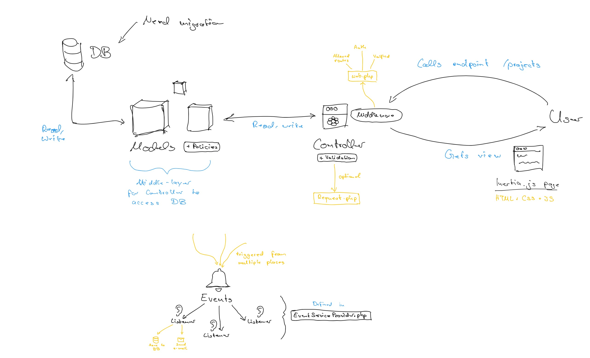
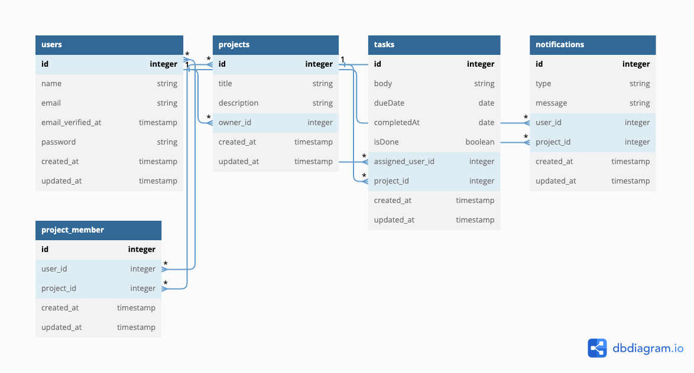

# **🤖 Laravel Productivity App**

A productivity app that allows users to create projects and tasks, collaborate with others, and track their activity
history built with PHP, Laravel, Inertia.js and React. See the live version here:

 

## **🪄 Features**

Users should be able to do the following:

- [x] Create and manage an account within the application
- [x] Create, update, delete projects
- [x] View projects in a dashboard
- [x] Create, update and delete tasks on top of projects
- [x] Invite other users to projects
- [x] Assign other project members to tasks
- [x] Save and show what activity there is in a project

  ---

Upcoming features to be implemented:

- [ ] Reorder tasks
- [ ] Set a status to tasks

 

## **💫 Implementation**

This application utilizes PHP and Laravel to create a monolithic backend and is hosted on DigitalOcean, which offers a
reliable and scalable cloud platform that offers high-performance infrastructure. Laravel Forge is employed as a server
management tool, simplifying the process of deploying, configuring, and maintaining the server environment, thus
ensuring seamless integration with DigitalOcean. For the frontend, I've combined Inertia.js with React. Inertia.js is a
framework that enables building single-page applications using classic server-side routing, allowing seamless
communication between the Laravel backend and the React frontend, without the need for building a separate API.

### Tech Stack

To build this service I used following tech stack:

- PHP
- Laravel
- React
- JavaScript
- Inertia.js

 

## **🧱 Architecture**

The following is a visualisation of the archictecture of the application, showing what happends when a user makes a
request:

  

## **🚀 Development Server Setup**

Ensure that your local machine has PHP and Composer installed.
See [here](https://laravel.com/docs/10.x#your-first-laravel-project) for more information.

Run the following commands to start a development server:

1. Rename .env.example file to .env inside your project root and fill the database information. (windows wont let you do
   it, so you have to open your console cd your project root directory and run mv .env.example .env )
2. Open the console and cd your project root directory
3. Run composer install or php composer.phar install
4. Run `php artisan migrate` to run DB migrations
5. Run `php artisan serve` to start the laravel application
6. Run `npm run dev` in another teminal to start the frontend

You can now visit your project at `http://localhost:8000`.

 

## **🧪 Testing & CI Pipelines**

> All test files are defined at `./tests`

Different options are available for testing the server, you can run:

- `php artisan test` to run all tests
- `php artisan test --filter=TestName `to run a specific test

 

## **🗂 API**

> All web routes are defined at `./routes/web.php`

**Manage Project**:

| Verb      | URI                 | Description           | 
|-----------|---------------------|-----------------------|
| GET       | /projects           | View your projects    | 
| POST      | /projects           | Create a project      |
| GET       | /projects/{project} | View a single project |
| PUT/PATCH | /projects/{project} | Update a project      |
| DELETE    | /projects/{project} | Delete a project      |

**Project Tasks**:

| Verb      | URI                              | Description   | 
|-----------|----------------------------------|---------------|
| POST      | /projects/tasks                  | Create a task |
| DELETE    | /projects/{project}/tasks/{task} | Delete a task |
| PUT/PATCH | /projects/{project}/tasks/{task} | Update a task |

**Project Invitations**:

| Verb | URI                        | Description                      | 
|------|----------------------------|----------------------------------|
| POST | /projects/{project}/invite | Invite another user to a project |
| POST | /projects/{project}/leave  | Leave a project                  |

## **💽 Database Schema model**

The following shows the database schema and relationship between models. View the database schema on an interactive
playground [here](https://dbdiagram.io/d/6447b7b16b31947051292f18).

 

---

🎉 Thanks for reading 

